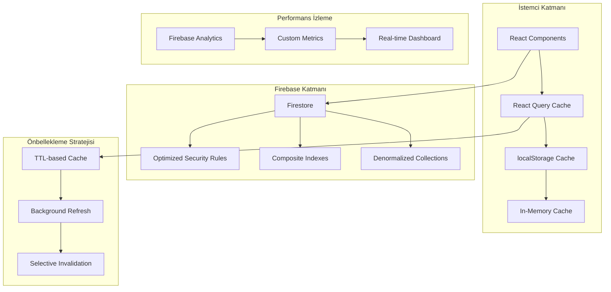
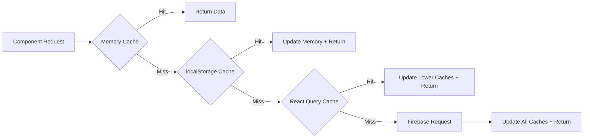

# Firebase Optimizasyon Design Dokümanı

## Genel Bakış

Bu design dokümanı, Novelytical uygulamasının Firebase kullanımını optimize etmek için kapsamlı bir yaklaşım sunmaktadır. Mevcut sistem analizi gösteriyor ki uygulama aşırı okuma işlemleri (151/periyot) ve kural değerlendirmeleri (15.000/periyot) gerçekleştirmektedir. Bu optimizasyon projesi, bu sayıları sırasıyla %70 azaltarak 45 okuma işlemi ve 4.500 kural değerlendirmesine düşürmeyi hedeflemektedir.

Optimizasyon stratejisi üç ana katmanda gerçekleştirilecektir:
1. **İstemci Tarafı Önbellekleme**: React Query, localStorage ve in-memory cache stratejileri
2. **Firebase Yapısal Optimizasyonlar**: Denormalizasyon, indeksleme ve güvenlik kuralları basitleştirme
3. **Performans İzleme**: Gerçek zamanlı metrik toplama ve analiz

## Mimari

### Mevcut Sistem Analizi

Mevcut Novelytical uygulaması hibrit bir mimari kullanmaktadır:
- **Backend**: .NET Core API (PostgreSQL + Redis cache)
- **Frontend**: Next.js (TypeScript/React)
- **Firebase**: Kullanıcı kimlik doğrulama ve potansiyel veri depolama

Mevcut kod analizi şunları göstermektedir:
- Discovery sayfası 4 ayrı API çağrısı yapıyor (trending, new arrivals, editor's choice, fantasy)
- Her şerit bileşeni bağımsız veri çekiyor
- Önbellekleme sadece backend seviyesinde (Redis)
- Frontend'de sistematik önbellekleme yok

### Hedef Mimari



## Bileşenler ve Arayüzler

### 1. Cache Manager Bileşeni

```typescript
interface CacheManager {
  // Cache stratejileri
  get<T>(key: string): Promise<T | null>;
  set<T>(key: string, value: T, ttl?: number): Promise<void>;
  invalidate(pattern: string): Promise<void>;
  
  // Cache katmanları
  memory: MemoryCache;
  localStorage: LocalStorageCache;
  reactQuery: QueryClient;
}

interface CacheConfig {
  staticContentTTL: number; // 30-60 dakika
  dynamicContentTTL: number; // 5-10 dakika
  maxMemorySize: number;
  compressionEnabled: boolean;
}
```

### 2. Firebase Query Optimizer

```typescript
interface FirebaseQueryOptimizer {
  // Tek endpoint tasarımı
  getDiscoveryData(): Promise<DiscoveryData>;
  
  // Lazy loading
  getStoryTowerData(novelId: string, offset?: number): Promise<StoryTowerData>;
  
  // Listener yönetimi
  createOptimizedListener(query: Query, callback: Function): () => void;
  
  // Batch operations
  batchRead(queries: Query[]): Promise<DocumentSnapshot[]>;
}

interface DiscoveryData {
  trending: NovelSummary[];
  newArrivals: NovelSummary[];
  editorsChoice: NovelSummary[];
  fantasy: NovelSummary[];
  metadata: {
    lastUpdated: Timestamp;
    cacheVersion: string;
  };
}
```

### 3. Performance Monitor

```typescript
interface PerformanceMonitor {
  // Metrik toplama
  trackFirebaseRead(collection: string, count: number): void;
  trackRuleEvaluation(ruleId: string, duration: number): void;
  trackCacheHit(cacheType: string, key: string): void;
  trackCacheMiss(cacheType: string, key: string): void;
  
  // Analiz
  getOptimizationReport(): OptimizationReport;
  detectPerformanceRegression(): RegressionAlert[];
}

interface OptimizationReport {
  readOperations: {
    current: number;
    target: number;
    reduction: number;
  };
  ruleEvaluations: {
    current: number;
    target: number;
    reduction: number;
  };
  cacheEfficiency: {
    hitRate: number;
    missRate: number;
    avgResponseTime: number;
  };
}
```

## Veri Modelleri

### 1. Denormalize Edilmiş Discovery Collection

```typescript
interface DiscoveryDocument {
  id: string;
  version: string;
  lastUpdated: Timestamp;
  
  // Tüm şeritleri tek dokümanda
  lanes: {
    trending: {
      novels: NovelSummary[];
      metadata: LaneMetadata;
    };
    newArrivals: {
      novels: NovelSummary[];
      metadata: LaneMetadata;
    };
    editorsChoice: {
      novels: NovelSummary[];
      metadata: LaneMetadata;
    };
    fantasy: {
      novels: NovelSummary[];
      metadata: LaneMetadata;
    };
  };
}

interface NovelSummary {
  id: string;
  title: string;
  author: string;
  coverUrl: string;
  rating: number;
  chapterCount: number;
  tags: string[];
  // Sadece gerekli alanlar
}

interface LaneMetadata {
  count: number;
  lastRefresh: Timestamp;
  nextRefresh: Timestamp;
}
```

### 2. Optimize Edilmiş Story Tower Modeli

```typescript
interface StoryTowerDocument {
  novelId: string;
  
  // Sayfalanmış kütüphane bilgileri
  libraryInfo: {
    totalCollections: number;
    collections: LibraryCollection[];
    hasMore: boolean;
    nextCursor?: string;
  };
  
  // Önbelleğe alınmış meta veriler
  novelMetadata: {
    title: string;
    author: string;
    totalChapters: number;
    lastUpdated: Timestamp;
  };
}

interface LibraryCollection {
  id: string;
  name: string;
  novelCount: number;
  description?: string;
  // Tam koleksiyon verisi değil, sadece özet
}
```

### 3. Cache Metadata Modeli

```typescript
interface CacheMetadata {
  key: string;
  createdAt: Timestamp;
  expiresAt: Timestamp;
  accessCount: number;
  lastAccessed: Timestamp;
  size: number;
  compressionRatio?: number;
}
```

## Önbellekleme Stratejileri

### 1. Çok Katmanlı Cache Mimarisi



### 2. TTL Stratejileri

| Veri Türü | TTL | Gerekçe |
|-----------|-----|---------|
| Discovery Lanes | 30 dakika | Günde birkaç kez güncellenen statik içerik |
| Novel Metadata | 60 dakika | Nadiren değişen temel bilgiler |
| Story Tower | 15 dakika | Orta sıklıkta güncellenen kütüphane bilgileri |
| User Preferences | 24 saat | Kullanıcı ayarları nadiren değişir |
| Search Results | 10 dakika | Dinamik içerik, sık güncelleme gerekir |

### 3. Cache Invalidation Stratejileri

```typescript
interface CacheInvalidationStrategy {
  // Zaman tabanlı
  timeBasedInvalidation(ttl: number): void;
  
  // Olay tabanlı
  eventBasedInvalidation(eventType: string, affectedKeys: string[]): void;
  
  // Versiyon tabanlı
  versionBasedInvalidation(dataVersion: string): void;
  
  // Seçici temizleme
  selectiveInvalidation(pattern: RegExp): void;
}
```

## Firebase Güvenlik Kuralları Optimizasyonu

### Mevcut Kural Karmaşıklığı Analizi

Tipik karmaşık kural örneği:
```javascript
// Karmaşık - çoklu değerlendirme
match /novels/{novelId} {
  allow read: if request.auth != null 
    && (resource.data.isPublic == true 
      || resource.data.author == request.auth.uid
      || exists(/databases/$(database)/documents/subscriptions/$(request.auth.uid))
      || get(/databases/$(database)/documents/users/$(request.auth.uid)).data.role == 'admin');
}
```

### Optimize Edilmiş Kural Yapısı

```javascript
// Basitleştirilmiş - tek değerlendirme
match /novels/{novelId} {
  allow read: if request.auth != null && isAuthorizedUser();
}

// Yardımcı fonksiyon - önceden hesaplanmış
function isAuthorizedUser() {
  return request.auth.token.authorized == true;
}
```

### Kural Optimizasyon Stratejileri

1. **Önceden Hesaplanmış Yetkilendirme**
   - Kullanıcı token'larında yetkilendirme bilgilerini sakla
   - Karmaşık sorguları client-side'da çöz

2. **Koleksiyon Seviyesi Kurallar**
   - Alt koleksiyon kurallarını minimize et
   - Üst seviye kuralları tercih et

3. **Kural Fonksiyonları**
   - Tekrarlanan mantığı fonksiyonlara çıkar
   - Kural değerlendirme adımlarını azalt

## Discovery Sayfası Tek Endpoint Tasarımı

### Mevcut Durum
```typescript
// 4 ayrı API çağrısı
const trending = await fetchNovels({ sortOrder: 'rank_desc', pageSize: 10 });
const newArrivals = await fetchNovels({ sortOrder: 'date_desc', pageSize: 12 });
const editorsChoice = await fetchNovels({ sortOrder: 'rating_desc', pageSize: 12 });
const fantasy = await fetchNovels({ tags: ['Fantastik'], pageSize: 12 });
```

### Optimize Edilmiş Yaklaşım
```typescript
// Tek API çağrısı
const discoveryData = await getDiscoveryData();

interface DiscoveryEndpoint {
  path: '/api/discovery';
  method: 'GET';
  response: {
    trending: NovelSummary[];
    newArrivals: NovelSummary[];
    editorsChoice: NovelSummary[];
    fantasy: NovelSummary[];
    metadata: {
      generatedAt: string;
      cacheExpiry: string;
      version: string;
    };
  };
}
```

### Backend Optimizasyonu
```csharp
public class DiscoveryQueryHandler : IRequestHandler<DiscoveryQuery, DiscoveryResponse>
{
    public async Task<DiscoveryResponse> Handle(DiscoveryQuery request, CancellationToken cancellationToken)
    {
        // Tek sorgu ile tüm verileri al
        var allNovels = await _repository.GetOptimizedDiscoveryData();
        
        return new DiscoveryResponse
        {
            Trending = allNovels.OrderByDescending(n => n.RankScore).Take(10),
            NewArrivals = allNovels.OrderByDescending(n => n.LastUpdated).Take(12),
            EditorsChoice = allNovels.OrderByDescending(n => n.Rating).Take(12),
            Fantasy = allNovels.Where(n => n.Tags.Contains("Fantastik")).Take(12)
        };
    }
}
```

## Story Tower Lazy Loading Mimarisi

### Mevcut Problem
```typescript
// Tüm kütüphane koleksiyonunu yükler
const allCollections = await getLibraryCollections(novelId);
```

### Lazy Loading Çözümü
```typescript
interface StoryTowerLazyLoader {
  // İlk yükleme - sadece temel bilgiler
  getInitialData(novelId: string): Promise<StoryTowerInitial>;
  
  // Sayfalanmış yükleme
  getCollectionPage(novelId: string, cursor?: string, limit?: number): Promise<CollectionPage>;
  
  // İsteğe bağlı detay yükleme
  getCollectionDetails(collectionId: string): Promise<CollectionDetails>;
}

interface StoryTowerInitial {
  novelMetadata: NovelMetadata;
  collectionSummary: {
    totalCount: number;
    featuredCollections: CollectionSummary[];
  };
}

interface CollectionPage {
  collections: CollectionSummary[];
  nextCursor?: string;
  hasMore: boolean;
}
```

### Virtualization Stratejisi
```typescript
// React Virtualization ile performans optimizasyonu
const StoryTowerVirtualized = () => {
  const [collections, setCollections] = useState<Collection[]>([]);
  const [loading, setLoading] = useState(false);
  
  const loadMoreCollections = useCallback(async (startIndex: number) => {
    if (loading) return;
    
    setLoading(true);
    const newCollections = await getCollectionPage(novelId, startIndex, 20);
    setCollections(prev => [...prev, ...newCollections.collections]);
    setLoading(false);
  }, [novelId, loading]);
  
  return (
    <FixedSizeList
      height={600}
      itemCount={collections.length}
      itemSize={80}
      onItemsRendered={({ visibleStopIndex }) => {
        if (visibleStopIndex >= collections.length - 5) {
          loadMoreCollections(collections.length);
        }
      }}
    >
      {CollectionItem}
    </FixedSizeList>
  );
};
```

## Real-time Listener Optimizasyon Stratejileri

### 1. Listener Havuzlama (Pooling)

```typescript
class ListenerPool {
  private listeners = new Map<string, ListenerInstance>();
  private subscribers = new Map<string, Set<Function>>();
  
  subscribe(query: string, callback: Function): () => void {
    if (!this.listeners.has(query)) {
      // Yeni listener oluştur
      const listener = this.createListener(query);
      this.listeners.set(query, listener);
      this.subscribers.set(query, new Set());
    }
    
    // Callback'i ekle
    this.subscribers.get(query)!.add(callback);
    
    // Unsubscribe fonksiyonu
    return () => {
      this.subscribers.get(query)?.delete(callback);
      if (this.subscribers.get(query)?.size === 0) {
        this.cleanupListener(query);
      }
    };
  }
  
  private createListener(query: string): ListenerInstance {
    return onSnapshot(
      this.parseQuery(query),
      (snapshot) => {
        const callbacks = this.subscribers.get(query);
        callbacks?.forEach(callback => callback(snapshot));
      }
    );
  }
}
```

### 2. Hedefli Listener Stratejisi

```typescript
// Geniş koleksiyon listener'ı yerine
const broadListener = onSnapshot(
  collection(db, 'novels'),
  (snapshot) => { /* Tüm değişiklikleri işle */ }
);

// Hedefli listener kullan
const targetedListener = onSnapshot(
  query(
    collection(db, 'novels'),
    where('category', '==', 'trending'),
    limit(10)
  ),
  (snapshot) => { /* Sadece ilgili değişiklikleri işle */ }
);
```

### 3. Batch Update Stratejisi

```typescript
class BatchUpdateManager {
  private pendingUpdates = new Map<string, any>();
  private batchTimeout: NodeJS.Timeout | null = null;
  
  scheduleUpdate(key: string, data: any) {
    this.pendingUpdates.set(key, data);
    
    if (this.batchTimeout) {
      clearTimeout(this.batchTimeout);
    }
    
    this.batchTimeout = setTimeout(() => {
      this.processBatch();
    }, 100); // 100ms batch window
  }
  
  private processBatch() {
    const updates = Array.from(this.pendingUpdates.entries());
    this.pendingUpdates.clear();
    
    // Toplu güncelleme işle
    this.handleBatchUpdate(updates);
  }
}
```

## Denormalizasyon Yaklaşımları

### 1. Discovery Data Denormalizasyonu

```typescript
// Normalize edilmiş yapı (mevcut)
interface Novel {
  id: string;
  title: string;
  authorId: string; // Referans
  categoryIds: string[]; // Referanslar
}

interface Author {
  id: string;
  name: string;
}

interface Category {
  id: string;
  name: string;
}

// Denormalize edilmiş yapı (optimize)
interface NovelDenormalized {
  id: string;
  title: string;
  author: {
    id: string;
    name: string;
  };
  categories: Array<{
    id: string;
    name: string;
  }>;
  // Discovery için gerekli tüm veriler
  discoveryMetadata: {
    trendingScore: number;
    isNewArrival: boolean;
    isEditorsChoice: boolean;
    primaryGenre: string;
  };
}
```

### 2. Veri Tutarlılığı Stratejisi

```typescript
interface DataConsistencyManager {
  // Ana veri güncellendiğinde denormalize kopyaları güncelle
  updateDenormalizedData(sourceId: string, updates: Partial<any>): Promise<void>;
  
  // Tutarlılık kontrolü
  validateConsistency(sourceCollection: string, targetCollections: string[]): Promise<ConsistencyReport>;
  
  // Otomatik senkronizasyon
  setupAutoSync(sourceCollection: string, targetCollections: string[]): void;
}

// Cloud Function ile otomatik senkronizasyon
export const syncDenormalizedData = functions.firestore
  .document('novels/{novelId}')
  .onUpdate(async (change, context) => {
    const before = change.before.data();
    const after = change.after.data();
    
    // Değişen alanları tespit et
    const changedFields = detectChanges(before, after);
    
    // İlgili denormalize koleksiyonları güncelle
    await updateRelatedCollections(context.params.novelId, changedFields);
  });
```

### 3. Composite Index Stratejisi

```typescript
// Firestore composite indexes
const indexes = [
  {
    collectionGroup: 'novels',
    fields: [
      { fieldPath: 'discoveryMetadata.trendingScore', order: 'DESCENDING' },
      { fieldPath: 'publishedAt', order: 'DESCENDING' }
    ]
  },
  {
    collectionGroup: 'novels',
    fields: [
      { fieldPath: 'discoveryMetadata.primaryGenre', order: 'ASCENDING' },
      { fieldPath: 'rating', order: 'DESCENDING' },
      { fieldPath: 'publishedAt', order: 'DESCENDING' }
    ]
  }
];
```

## Performans İzleme Araçları

### 1. Firebase Performance Monitoring

```typescript
interface FirebasePerformanceTracker {
  // Okuma işlemi izleme
  trackRead(collection: string, documentCount: number): void;
  
  // Kural değerlendirme izleme
  trackRuleEvaluation(rulePath: string, evaluationTime: number): void;
  
  // Cache performans izleme
  trackCachePerformance(cacheType: string, operation: string, duration: number): void;
  
  // Özel metrikler
  recordCustomMetric(name: string, value: number, attributes?: Record<string, string>): void;
}

class PerformanceTracker implements FirebasePerformanceTracker {
  private analytics = getAnalytics();
  
  trackRead(collection: string, documentCount: number): void {
    logEvent(this.analytics, 'firebase_read', {
      collection,
      document_count: documentCount,
      timestamp: Date.now()
    });
  }
  
  trackRuleEvaluation(rulePath: string, evaluationTime: number): void {
    logEvent(this.analytics, 'rule_evaluation', {
      rule_path: rulePath,
      evaluation_time: evaluationTime,
      timestamp: Date.now()
    });
  }
}
```

### 2. Real-time Dashboard

```typescript
interface PerformanceDashboard {
  // Gerçek zamanlı metrikler
  getCurrentMetrics(): Promise<CurrentMetrics>;
  
  // Trend analizi
  getTrendAnalysis(timeRange: TimeRange): Promise<TrendData>;
  
  // Uyarı sistemi
  setupAlerts(thresholds: AlertThresholds): void;
  
  // Optimizasyon önerileri
  getOptimizationSuggestions(): Promise<OptimizationSuggestion[]>;
}

interface CurrentMetrics {
  readOperations: {
    current: number;
    target: number;
    percentage: number;
  };
  ruleEvaluations: {
    current: number;
    target: number;
    percentage: number;
  };
  cacheHitRate: number;
  averageResponseTime: number;
}

interface OptimizationSuggestion {
  type: 'cache' | 'query' | 'rule' | 'denormalization';
  priority: 'high' | 'medium' | 'low';
  description: string;
  estimatedImpact: {
    readReduction: number;
    ruleReduction: number;
    performanceGain: number;
  };
  implementationComplexity: 'low' | 'medium' | 'high';
}
```

### 3. Maliyet Analizi Araçları

```typescript
interface CostAnalyzer {
  // Günlük maliyet hesaplama
  calculateDailyCost(): Promise<CostBreakdown>;
  
  // Optimizasyon etkisi tahmini
  estimateOptimizationSavings(optimizations: OptimizationType[]): Promise<SavingsEstimate>;
  
  // Maliyet uyarıları
  setupCostAlerts(thresholds: CostThresholds): void;
}

interface CostBreakdown {
  reads: {
    count: number;
    cost: number;
  };
  writes: {
    count: number;
    cost: number;
  };
  storage: {
    size: number;
    cost: number;
  };
  bandwidth: {
    usage: number;
    cost: number;
  };
  total: number;
}
```

## Hata Yönetimi

### 1. Cache Fallback Stratejisi

```typescript
class CacheWithFallback {
  async get<T>(key: string): Promise<T | null> {
    try {
      // Önce memory cache'i dene
      const memoryResult = await this.memoryCache.get<T>(key);
      if (memoryResult) return memoryResult;
      
      // Sonra localStorage'ı dene
      const localResult = await this.localStorage.get<T>(key);
      if (localResult) {
        // Memory cache'i güncelle
        await this.memoryCache.set(key, localResult);
        return localResult;
      }
      
      // Son olarak Firebase'den çek
      const firebaseResult = await this.fetchFromFirebase<T>(key);
      if (firebaseResult) {
        // Tüm cache katmanlarını güncelle
        await this.updateAllCaches(key, firebaseResult);
        return firebaseResult;
      }
      
      return null;
    } catch (error) {
      // Hata durumunda stale cache'i kullan
      return await this.getStaleCache<T>(key);
    }
  }
}
```

### 2. Graceful Degradation

```typescript
interface GracefulDegradationStrategy {
  // Kısmi veri yükleme
  loadPartialData(requiredFields: string[]): Promise<Partial<any>>;
  
  // Fallback UI
  renderFallbackUI(error: Error): React.ReactElement;
  
  // Offline destek
  enableOfflineMode(): void;
  
  // Retry mekanizması
  retryWithBackoff(operation: () => Promise<any>, maxRetries: number): Promise<any>;
}
```

### 3. Error Boundary ve Monitoring

```typescript
class FirebaseErrorBoundary extends React.Component {
  componentDidCatch(error: Error, errorInfo: React.ErrorInfo) {
    // Firebase hatalarını özel olarak işle
    if (error.message.includes('firebase')) {
      this.handleFirebaseError(error);
    }
    
    // Hata raporlama
    this.reportError(error, errorInfo);
  }
  
  private handleFirebaseError(error: Error) {
    // Cache'den veri yüklemeyi dene
    this.setState({ useCache: true });
    
    // Kullanıcıya bilgi ver
    this.showUserNotification('Bağlantı sorunu, önbelleğe alınmış veriler gösteriliyor');
  }
}
```

## Test Stratejisi

### 1. Unit Test Yaklaşımı

Cache bileşenleri için temel unit testler:
- Cache hit/miss senaryoları
- TTL expiration testleri
- Fallback mekanizması testleri
- Error handling testleri

### 2. Integration Test Yaklaşımı

Firebase entegrasyonu için integration testler:
- End-to-end cache flow testleri
- Performance regression testleri
- Real-time listener testleri
- Batch operation testleri

## Correctness Properties

*A property is a characteristic or behavior that should hold true across all valid executions of a system-essentially, a formal statement about what the system should do. Properties serve as the bridge between human-readable specifications and machine-verifiable correctness guarantees.*

### Property Reflection

Prework analizinde 41 adet testable property tespit edilmiştir. Property reflection sonucunda aşağıdaki redundancy'ler ve consolidation fırsatları belirlenmiştir:

**Redundancy Eliminations:**
- Properties 1.2, 5.3: Her ikisi de cache hit durumunda Firebase okuma yapılmamasını test eder → Tek property'de birleştirilebilir
- Properties 1.3, 3.3: Her ikisi de TTL tabanlı cache davranışını test eder → Tek property'de birleştirilebilir  
- Properties 2.2, 2.3, 2.4: Tümü kural optimizasyonunu farklı açılardan test eder → Tek comprehensive property'de birleştirilebilir
- Properties 4.2, 4.4: Her ikisi de roman meta verisi optimizasyonunu test eder → Tek property'de birleştirilebilir
- Properties 6.1, 6.3: Her ikisi de index optimizasyonunu test eder → Tek property'de birleştirilebilir
- Properties 7.1, 7.4: Her ikisi de listener optimizasyonunu test eder → Tek property'de birleştirilebilir

**Final Consolidated Properties (25 adet):**

### Performance Optimization Properties

**Property 1: Firebase Read Operation Reduction**
*For any* measurement period, the total Firebase read operations should not exceed 45 operations, representing a 70% reduction from the baseline of 151 operations
**Validates: Requirements 1.1**

**Property 2: Cache Hit Efficiency**  
*For any* repeated data request within TTL period, the cache layer should serve the data without triggering new Firebase read operations
**Validates: Requirements 1.2, 5.3**

**Property 3: TTL-based Cache Behavior**
*For any* cached data within its TTL period, subsequent requests should return cached data; after TTL expiry, fresh data should be fetched and cached
**Validates: Requirements 1.3, 3.3**

**Property 4: Real-time Listener Optimization**
*For any* set of components requesting the same data, the system should create and share a single listener instance rather than multiple duplicate listeners
**Validates: Requirements 1.4, 7.4**

**Property 5: Cache Consistency Maintenance**
*For any* cached data, the cache layer should maintain data consistency by refreshing expired entries and invalidating stale data according to configured TTL periods
**Validates: Requirements 1.5**

### Security Rules Optimization Properties

**Property 6: Rule Evaluation Reduction**
*For any* measurement period, the total Firebase rule evaluations should not exceed 4,500 evaluations, representing a 70% reduction from the baseline of 15,000 evaluations
**Validates: Requirements 2.1**

**Property 7: Optimized Rule Efficiency**
*For any* security rule evaluation, the optimized rules should provide equivalent security protection with fewer evaluation steps compared to the original complex rules
**Validates: Requirements 2.2, 2.3, 2.4**

**Property 8: Security Level Preservation**
*For any* security scenario, the optimized rule system should maintain all existing security constraints without introducing vulnerabilities
**Validates: Requirements 2.5**

### Discovery Page Optimization Properties

**Property 9: Single API Call Optimization**
*For any* discovery page load, the system should fetch all lane data (trending, popular, new arrivals, featured) using exactly one API call instead of four separate calls
**Validates: Requirements 3.1**

**Property 10: Composite Index Utilization**
*For any* lane data request, the system should use composite indexes to efficiently retrieve trending, popular, new arrivals, and featured content in a single optimized query
**Validates: Requirements 3.2**

**Property 11: Selective Cache Invalidation**
*For any* lane content update, the system should selectively invalidate only the affected cache entries and refresh data without affecting unrelated cached content
**Validates: Requirements 3.4**

**Property 12: Denormalization Query Optimization**
*For any* multiple lanes sharing similar data, the system should use denormalized structures to minimize query complexity and reduce redundant data fetching
**Validates: Requirements 3.5**

### Story Tower Optimization Properties

**Property 13: Lazy Loading Prevention**
*For any* novel page visit, the system should not load the complete library collection data upfront
**Validates: Requirements 4.1**

**Property 14: Targeted Query Efficiency**
*For any* story tower data requirement, the system should fetch only the relevant novel metadata using targeted queries rather than loading unnecessary data
**Validates: Requirements 4.2, 4.4**

**Property 15: Denormalized Data Usage**
*For any* library information display, the system should use denormalized novel data to avoid collection traversal and reduce query complexity
**Validates: Requirements 4.3**

**Property 16: Optimized Reference Structures**
*For any* novel relationships, the system should use optimized reference structures instead of full collection queries to maintain performance
**Validates: Requirements 4.5**

### Caching Strategy Properties

**Property 17: TTL Configuration Optimization**
*For any* data type, the cache layer should use optimized TTL periods based on data update frequency (30-60 minutes for static content, 5-10 minutes for dynamic content)
**Validates: Requirements 5.1**

**Property 18: Background Cache Refresh**
*For any* expired cached data, the system should refresh cache entries through background processes to maintain user experience
**Validates: Requirements 5.2**

**Property 19: Cache Miss Handling**
*For any* cache miss occurrence, the system should fetch the requested data and populate the cache while serving the request
**Validates: Requirements 5.4**

**Property 20: Selective Cache Invalidation Support**
*For any* cache invalidation requirement, the cache layer should support selective cache clearing for specific data types using pattern-based invalidation
**Validates: Requirements 5.5**

### Database Structure Optimization Properties

**Property 21: Composite Index Query Support**
*For any* complex query requirement, the system should support efficient execution using composite indexes without requiring multiple separate queries
**Validates: Requirements 6.1, 6.3**

**Property 22: Denormalization Storage Optimization**
*For any* frequently accessed data, the system should store it in optimized denormalized structures to reduce query complexity and improve access speed
**Validates: Requirements 6.2**

**Property 23: Subcollection Traversal Minimization**
*For any* data relationship modeling, the system should minimize the need for subcollection traversal through optimized data structures
**Validates: Requirements 6.4**

**Property 24: Denormalized Data Synchronization**
*For any* data consistency requirement, the system should maintain synchronized denormalized data through automated processes
**Validates: Requirements 6.5**

### Real-time Listener Management Properties

**Property 25: Targeted Listener Strategy**
*For any* real-time listener setup, the system should use targeted listeners for specific data subsets rather than broad collection listeners
**Validates: Requirements 7.1**

**Property 26: Batch Update Processing**
*For any* listener updates, the system should process related changes in batches to minimize individual update events
**Validates: Requirements 7.2**

**Property 27: Listener Cleanup Management**
*For any* page navigation, the system should properly detach listeners to prevent memory leaks and unnecessary updates
**Validates: Requirements 7.3**

**Property 28: Listener Pooling Efficiency**
*For any* critical listener efficiency requirement, the system should implement listener pooling and connection management for optimal performance
**Validates: Requirements 7.5**

### Performance Monitoring Properties

**Property 29: Comprehensive Metrics Collection**
*For any* optimization deployment, the system should provide detailed metrics on read operation counts, rule evaluations, and cache hit rates
**Validates: Requirements 8.1**

**Property 30: Performance Tracking and Detection**
*For any* active performance monitoring, the system should track query execution times and identify slow operations for optimization
**Validates: Requirements 8.2**

**Property 31: Optimization Opportunity Alerting**
*For any* usage pattern changes, the system should alert administrators about potential optimization opportunities
**Validates: Requirements 8.3**

**Property 32: Cost Analysis Reporting**
*For any* cost analysis requirement, the system should provide detailed breakdowns of Firebase usage costs by feature areas
**Validates: Requirements 8.4**

**Property 33: Regression Detection and Diagnosis**
*For any* performance regression occurrence, the system should provide diagnostic information to identify root causes
**Validates: Requirements 8.5**

## Hata Yönetimi

### 1. Cache Fallback Stratejisi

Firebase optimizasyonu sırasında çeşitli hata senaryoları için kapsamlı fallback mekanizmaları uygulanacaktır:

**Cache Layer Failures:**
- Memory cache hatası → localStorage'a fallback
- localStorage hatası → Direct Firebase query
- Firebase hatası → Stale cache kullanımı
- Tüm cache katmanları başarısız → Graceful degradation

**Implementation Strategy:**
```typescript
class ResilientCacheManager {
  async getData<T>(key: string): Promise<T | null> {
    const fallbackChain = [
      () => this.memoryCache.get<T>(key),
      () => this.localStorage.get<T>(key),
      () => this.reactQuery.getQueryData<T>(key),
      () => this.fetchFromFirebase<T>(key),
      () => this.getStaleCache<T>(key)
    ];
    
    for (const fallback of fallbackChain) {
      try {
        const result = await fallback();
        if (result) return result;
      } catch (error) {
        this.logFallbackAttempt(error);
        continue;
      }
    }
    
    return null;
  }
}
```

### 2. Network Resilience

**Offline Support:**
- Service Worker ile offline cache
- Background sync ile veri senkronizasyonu
- Progressive Web App özellikleri

**Connection Quality Adaptation:**
- Yavaş bağlantılarda cache TTL artırımı
- Bandwidth-aware content loading
- Adaptive quality settings

### 3. Error Monitoring ve Recovery

**Error Classification:**
- Firebase quota exceeded errors
- Network connectivity issues
- Cache corruption scenarios
- Security rule violations

**Recovery Strategies:**
- Exponential backoff retry mechanism
- Circuit breaker pattern implementation
- Graceful degradation with user notification
- Automatic error reporting ve analytics

## Test Stratejisi

### Dual Testing Approach

Firebase optimizasyonu için hem unit testler hem de property-based testler kullanılacaktır. Bu iki yaklaşım birbirini tamamlayarak kapsamlı test coverage sağlayacaktır.

### Unit Testing Strategy

**Cache Layer Unit Tests:**
- Cache hit/miss scenarios
- TTL expiration behavior
- Fallback mechanism validation
- Error handling edge cases
- Memory management tests

**Firebase Integration Unit Tests:**
- Security rule validation
- Query optimization verification
- Listener lifecycle management
- Batch operation correctness
- Cost calculation accuracy

**Performance Unit Tests:**
- Read operation counting
- Rule evaluation measurement
- Response time validation
- Memory usage monitoring
- Cache efficiency metrics

### Property-Based Testing Strategy

**Property Test Configuration:**
- Minimum 100 iterations per property test
- Firebase Emulator Suite for isolated testing
- Randomized test data generation
- Comprehensive input coverage

**Property Test Implementation:**
Her correctness property için ayrı property-based test yazılacaktır:

```typescript
// Example Property Test
describe('Property 2: Cache Hit Efficiency', () => {
  it('should serve repeated requests from cache without Firebase reads', 
    property(
      fc.string(), // cache key
      fc.record({ /* data structure */ }), // test data
      async (cacheKey, testData) => {
        // Setup
        await cacheManager.set(cacheKey, testData);
        
        // First request - should hit cache
        const result1 = await cacheManager.get(cacheKey);
        const initialReads = getFirebaseReadCount();
        
        // Second request - should also hit cache
        const result2 = await cacheManager.get(cacheKey);
        const finalReads = getFirebaseReadCount();
        
        // Assertions
        expect(result1).toEqual(testData);
        expect(result2).toEqual(testData);
        expect(finalReads).toEqual(initialReads); // No additional reads
      }
    )
  );
});
```

**Property Test Tags:**
Her property test şu format ile tag'lenecektir:
- **Feature: firebase-optimization, Property 1: Firebase Read Operation Reduction**
- **Feature: firebase-optimization, Property 2: Cache Hit Efficiency**
- **Feature: firebase-optimization, Property 3: TTL-based Cache Behavior**

### Integration Testing Strategy

**End-to-End Optimization Tests:**
- Complete user journey testing
- Performance regression detection
- Cross-browser compatibility
- Mobile device optimization

**Firebase Emulator Integration:**
- Isolated Firebase environment
- Reproducible test scenarios
- Security rule testing
- Cost simulation testing

### Performance Testing Strategy

**Load Testing:**
- Concurrent user simulation
- Cache performance under load
- Firebase quota limit testing
- Memory leak detection

**Benchmark Testing:**
- Before/after optimization comparison
- Performance metric validation
- Cost reduction verification
- User experience impact measurement

### Test Environment Setup

**Development Environment:**
- Firebase Emulator Suite
- Local cache simulation
- Mock data generation
- Performance profiling tools

**Staging Environment:**
- Production-like Firebase setup
- Real-world data volumes
- Network condition simulation
- Security rule validation

**Production Monitoring:**
- Real-time performance tracking
- Error rate monitoring
- Cost analysis validation
- User experience metrics

### Test Data Management

**Synthetic Data Generation:**
- Realistic novel data creation
- User behavior simulation
- Cache scenario generation
- Edge case data preparation

**Test Data Cleanup:**
- Automated test data removal
- Cache state reset
- Firebase emulator cleanup
- Memory leak prevention

Bu kapsamlı test stratejisi, Firebase optimizasyonunun tüm aspectlerinin doğru çalıştığını ve performance hedeflerine ulaştığını garanti edecektir.