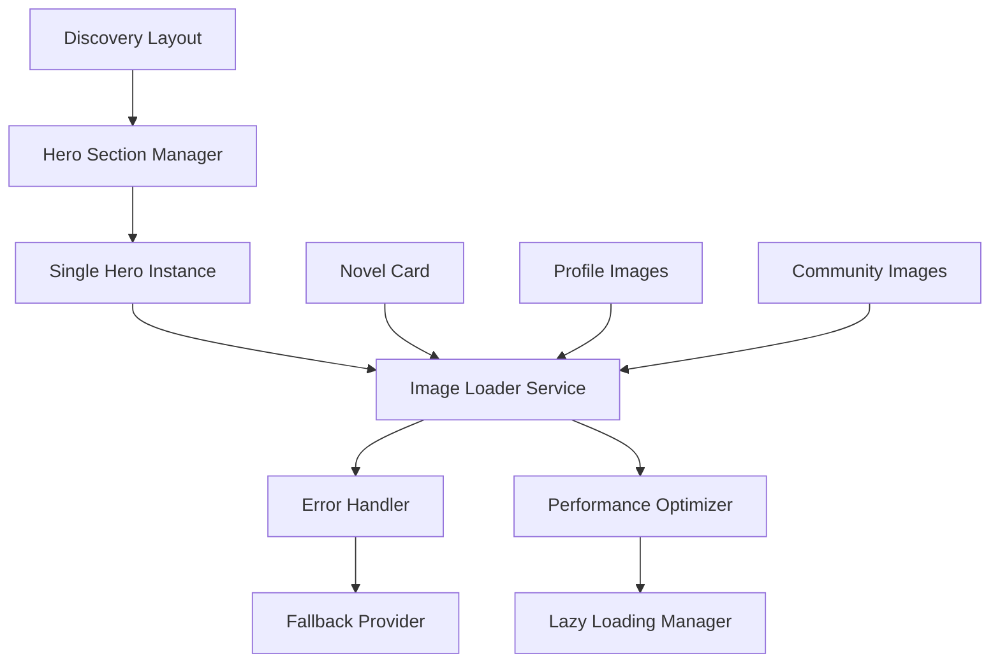

# Design Document: Image Loading Fixes

## Overview

Bu tasarım dokümanı, Novelytical platformundaki görsel yükleme sorunlarını ve ana sayfadaki tekrarlanan hero bölümü problemini çözmek için kapsamlı bir yaklaşım sunar. Sorunlar şu ana kategorilerde ele alınacaktır:

1. **Image Loading Infrastructure**: Next.js Image bileşeni yapılandırması ve error handling
2. **Hero Section Architecture**: Tekrarlanan hero bölümlerinin temizlenmesi
3. **Domain Configuration**: Harici görsel kaynaklarının güvenli yüklenmesi
4. **Performance Optimization**: Görsel yükleme performansının iyileştirilmesi
5. **Error Recovery**: Graceful fallback mekanizmaları

## Architecture

### Current State Analysis

Mevcut sistemde tespit edilen sorunlar:

1. **Duplicate Hero Sections**: 
   - `app/(discovery)/layout.tsx` içinde `<HeroServer />` 
   - `app/(discovery)/page.tsx` içinde `<HeroSection novels={heroNovels} />`
   - Bu durum ana sayfada iki hero bölümü oluşturuyor

2. **Image Loading Issues**:
   - Next.js Image bileşeninde error handling eksik
   - Placeholder/fallback mekanizması yok
   - Remote pattern yapılandırması eksik domainler içerebilir

3. **Performance Issues**:
   - Görsel optimizasyonu yetersiz
   - Priority loading eksik
   - Sizes attribute'u optimize edilmemiş

### Target Architecture



## Components and Interfaces

### 1. Enhanced Image Loader Component

```typescript
interface ImageLoaderProps {
  src: string;
  alt: string;
  fallbackSrc?: string;
  placeholder?: 'blur' | 'empty' | 'skeleton';
  priority?: boolean;
  sizes?: string;
  className?: string;
  onError?: (error: Error) => void;
  onLoad?: () => void;
  retryCount?: number;
}

interface ImageErrorHandler {
  handleError(error: Error, src: string): string; // Returns fallback URL
  logError(error: Error, context: string): void;
  shouldRetry(error: Error, attemptCount: number): boolean;
}
```

### 2. Hero Section Manager

```typescript
interface HeroSectionManager {
  novels: NovelListDto[];
  isLoading: boolean;
  error?: Error;
}

interface HeroSectionProps {
  novels: NovelListDto[];
  className?: string;
  showSearch?: boolean;
}
```

### 3. Image Domain Configuration

```typescript
interface ImageDomainConfig {
  protocol: 'https' | 'http';
  hostname: string;
  port?: number;
  pathname?: string;
}

interface ImageConfigManager {
  getAllowedDomains(): ImageDomainConfig[];
  isAllowedDomain(url: string): boolean;
  addDomain(config: ImageDomainConfig): void;
}
```

## Data Models

### Image Loading State

```typescript
enum ImageLoadingState {
  LOADING = 'loading',
  LOADED = 'loaded',
  ERROR = 'error',
  FALLBACK = 'fallback'
}

interface ImageLoadingContext {
  src: string;
  state: ImageLoadingState;
  error?: Error;
  retryCount: number;
  loadTime?: number;
}
```

### Error Types

```typescript
enum ImageErrorType {
  NETWORK_ERROR = 'network_error',
  INVALID_URL = 'invalid_url',
  DOMAIN_NOT_ALLOWED = 'domain_not_allowed',
  TIMEOUT = 'timeout',
  UNKNOWN = 'unknown'
}

interface ImageError extends Error {
  type: ImageErrorType;
  src: string;
  context?: string;
}
```

## Implementation Strategy

### Phase 1: Hero Section Duplication Fix

1. **Layout Cleanup**: `app/(discovery)/layout.tsx` dosyasından `<HeroServer />` kaldırılacak
2. **Single Source**: Hero section sadece `app/(discovery)/page.tsx` içinde kalacak
3. **Data Fetching**: Hero verisi tek noktada fetch edilecek
4. **Component Consolidation**: `HeroServer` ve `HeroSection` birleştirilecek

### Phase 2: Enhanced Image Loading

1. **Error Handling**: Image bileşenlerine `onError` ve `onLoad` handlers eklenecek
2. **Fallback System**: Placeholder görselleri ve graceful degradation
3. **Retry Logic**: Network hatalarında otomatik retry mekanizması
4. **Loading States**: Skeleton loaders ve progressive loading

### Phase 3: Domain Configuration Update

1. **Domain Audit**: Mevcut görsel kaynaklarının analizi
2. **Configuration Update**: `next.config.mjs` güncellemesi
3. **Dynamic Domain Support**: Runtime'da yeni domain ekleme
4. **Security Validation**: Domain whitelist kontrolü

### Phase 4: Performance Optimization

1. **Sizes Optimization**: Responsive image sizes
2. **Priority Loading**: Critical images için priority flag
3. **Lazy Loading**: Viewport-based loading
4. **Caching Strategy**: Browser ve CDN caching

## Error Handling

### Error Recovery Strategy

```typescript
class ImageErrorRecovery {
  private retryAttempts = new Map<string, number>();
  private fallbackUrls = new Map<string, string>();
  
  async handleImageError(src: string, error: Error): Promise<string> {
    const attempts = this.retryAttempts.get(src) || 0;
    
    if (attempts < 3 && this.isRetryableError(error)) {
      this.retryAttempts.set(src, attempts + 1);
      return src; // Retry same URL
    }
    
    return this.getFallbackUrl(src);
  }
  
  private isRetryableError(error: Error): boolean {
    return error.message.includes('network') || 
           error.message.includes('timeout');
  }
  
  private getFallbackUrl(originalSrc: string): string {
    // Return appropriate placeholder based on context
    if (originalSrc.includes('cover')) {
      return '/images/book-placeholder.png';
    }
    return '/images/default-placeholder.png';
  }
}
```

### Error Logging

```typescript
interface ErrorLogger {
  logImageError(error: ImageError): void;
  getErrorStats(): ImageErrorStats;
}

interface ImageErrorStats {
  totalErrors: number;
  errorsByType: Record<ImageErrorType, number>;
  errorsByDomain: Record<string, number>;
  averageRetryCount: number;
}
```

### Fallback Strategy

1. **Primary Fallback**: Retry original URL up to 3 times
2. **Secondary Fallback**: Use context-appropriate placeholder
3. **Tertiary Fallback**: Generic placeholder image
4. **Final Fallback**: Empty div with background color

### Error Monitoring

- Console logging for development
- Error tracking service integration for production
- Performance metrics collection
- User experience impact measurement

## Correctness Properties

*A property is a characteristic or behavior that should hold true across all valid executions of a system-essentially, a formal statement about what the system should do. Properties serve as the bridge between human-readable specifications and machine-verifiable correctness guarantees.*

### Property 1: Image Loading Success
*For any* valid image URL and page context, when the Image_Loader attempts to load the image, it should successfully render the image or show an appropriate placeholder
**Validates: Requirements 1.1, 1.2, 4.1**

### Property 2: Domain Configuration Completeness  
*For any* image URL used in the application, the Remote_Pattern configuration should include the domain of that URL
**Validates: Requirements 1.3, 3.1, 3.3**

### Property 3: URL Format Validation
*For any* external image source, the Image_Loader should use properly formatted HTTPS URLs that comply with Next.js Image requirements
**Validates: Requirements 1.4**

### Property 4: Error Handling and Logging
*For any* image loading error, the Image_Loader should log the error to console and provide graceful fallback behavior
**Validates: Requirements 1.5, 4.4**

### Property 5: Hero Section Uniqueness
*For any* page render in the discovery section, exactly one hero section should be present in the DOM
**Validates: Requirements 2.1, 2.2, 6.2**

### Property 6: Hero Background Image Loading
*For any* hero section render with novel data, all background images should load successfully or show appropriate fallbacks
**Validates: Requirements 2.4**

### Property 7: Dynamic Domain Management
*For any* new image domain added to the system, the Remote_Pattern configuration should be updated to include that domain
**Validates: Requirements 3.2**

### Property 8: Retry Mechanism
*For any* timeout or network error during image loading, the Image_Loader should attempt retry up to the configured limit
**Validates: Requirements 4.2**

### Property 9: Graceful Error Handling
*For any* invalid image URL, the Image_Loader should handle the error gracefully without breaking the UI
**Validates: Requirements 4.3**

### Property 10: Layout Stability
*For any* placeholder image display, the visual layout dimensions should remain consistent with the original image space
**Validates: Requirements 4.5**

### Property 11: Responsive Image Attributes
*For any* image rendered by Image_Loader, appropriate sizes attributes should be set based on the display context
**Validates: Requirements 5.1**

### Property 12: Priority Loading
*For any* critical image (hero, above-fold content), the priority loading flag should be applied
**Validates: Requirements 5.2**

### Property 13: Lazy Loading Optimization
*For any* images outside the initial viewport, lazy loading should be applied with appropriate intersection observer behavior
**Validates: Requirements 5.3**

### Property 14: Next.js Optimization Usage
*For any* image processed by Image_Loader, Next.js built-in optimization features should be utilized
**Validates: Requirements 5.4**

### Property 15: Progressive Loading
*For any* large image file, progressive loading should be implemented to improve perceived performance
**Validates: Requirements 5.5**

### Property 16: Component Prop Validation
*For any* hero section render, proper prop validation should prevent invalid data from causing render errors
**Validates: Requirements 6.4**

### Property 17: Cross-Page Consistency
*For any* hero section instance across different pages, the behavior and appearance should be consistent
**Validates: Requirements 6.5**

## Testing Strategy

### Dual Testing Approach
- **Unit tests**: Verify specific examples, edge cases, and error conditions
- **Property tests**: Verify universal properties across all inputs
- Both are complementary and necessary for comprehensive coverage

### Unit Testing Balance
Unit tests will focus on:
- Specific examples that demonstrate correct behavior
- Integration points between components  
- Edge cases and error conditions

Property tests will focus on:
- Universal properties that hold for all inputs
- Comprehensive input coverage through randomization

### Property-Based Testing Configuration
- Minimum 100 iterations per property test
- Each property test must reference its design document property
- Tag format: **Feature: image-loading-fixes, Property {number}: {property_text}**
- Each correctness property will be implemented by a single property-based test