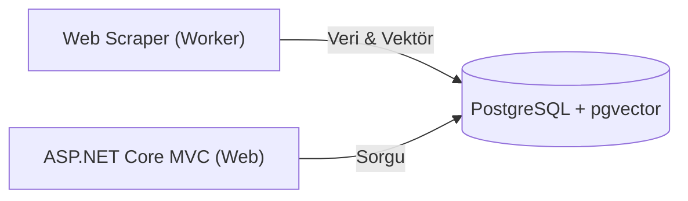

# 📚 Novelytical (v1.0)

**Novelytical**, web romanlarını analiz eden ve **Anlamsal Arama (Semantic Search)** teknolojisi ile kullanıcıların "kelime" yerine "konu/bağlam" üzerinden kitap bulmasını sağlayan, .NET tabanlı bir web uygulamasıdır.

> ⚠️ **Not:** Bu sürüm **Monolitik** mimaridedir. (Dockerizasyon ve Mikroservis dönüşümü öncesi snapshot).

## 🏗️ Mimari & Akış

Sistem **Monolitik** yapıda olup, veritabanı seviyesinde ayrışmış iki ana bileşenden oluşur:

1. **Novelytical.Worker:** Arka planda çalışır. Kaynak siteden (Royal Road) veriyi çeker (`Scraping`), metni temizler, yapay zeka vektörüne dönüştürür (`Embedding`) ve kaydeder.
2. **Novelytical.Web:** Kullanıcı arayüzüdür. Girilen arama metnini anlık olarak vektöre çevirir ve veritabanındaki en yakın vektörlerle (`Cosine Similarity`) eşleştirir.

## 🛠️ Teknoloji Yığını (Tech Stack)

### Backend & Core

* **Platform:** .NET 8 (C#)
* **Framework:** ASP.NET Core MVC
* **ORM:** Entity Framework Core (Code-First)
* **Database:** PostgreSQL 16
* **Scraping:** HtmlAgilityPack

### 🧠 Yapay Zeka & Arama (AI Stack)

* **Vector Database:** `pgvector` eklentisi (PostgreSQL üzerinde).
* **Embedding Model:** `Microsoft.SmartComponents.LocalEmbeddings` (On-Device / Offline).
* **Algoritma:** Cosine Similarity (Kosinüs Benzerliği).

### Frontend

* **Engine:** Razor Views (.cshtml)
* **UI Framework:** Bootstrap 5
* **Theme:** Bootswatch (Sketchy)

## ⚡ Temel Özellikler

* **Semantic Search:** "Zaman döngüsü" yazıldığında, içinde bu kelime geçmese bile *Mother of Learning* romanını bulabilme yeteneği.
* **Background Processing:** `Worker Service` mimarisi ile kesintisiz veri madenciliği.
* **Hybrid Data Storage:** İlişkisel veriler (Başlık, Yazar) ile Vektör verilerinin (Embedding) aynı tabloda hibrit yönetimi.

---

**Geliştirme Ortamı:** Visual Studio Code / Visual Studio 2022
**Lisans:** MIT
